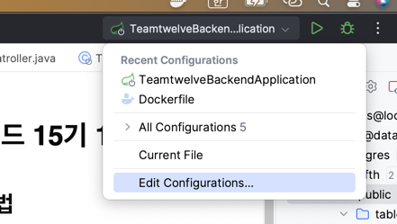
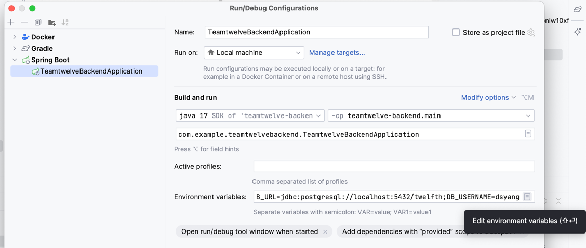
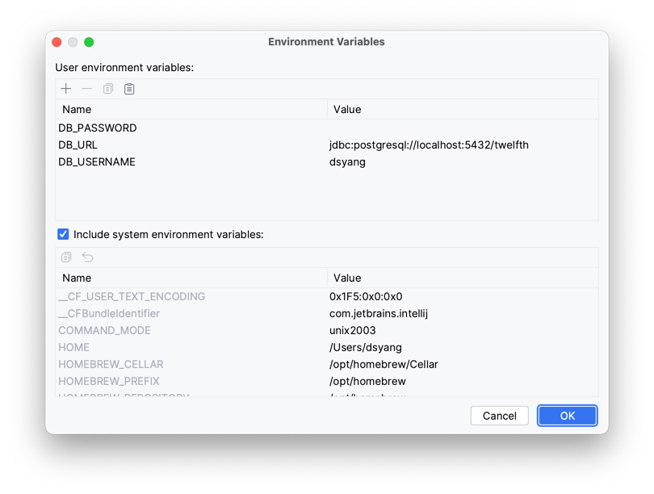

# 비사이드 15기 12팀 백엔드

## 실행 방법

build: gradle > build > bootJar

build 이후 docker run

### 로컬 데이터베이스 설정 방법 (Intellij IDEA)

Edit Configurations 로 진입

Environments variables 에 값을 입력. 맨 오른쪽에 문서 아이콘을 누르면 입력 도구가 열림

필요한 환경 변수 값을 로컬 환경에 맞게 입력

## 기술 스택

- Java 17
- Spring Boot 3.0.6
- PostgreSQL 14
